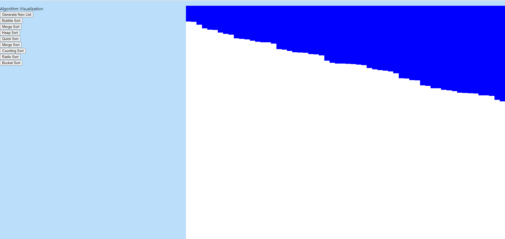

# AlgorithmVisualization

### This was being hosted on my home network with a Redis server also on my home network. Due to the security risk this poses I am currently moving this project to Azure Redis Cache and I will most likely host it on a box there.

## How to run
### Backend
`dart bin/dev.dart`

Make sure you have all the imported dart packages installed by running `pub get`

Change the redis cache to your own in dev.dart

### Frontend
`npm install`

`npm start`

## To Do
- [X] Clean up UI
- [ ] Finish writing algorithm
- [ ] Highlight when complete.
- [ ] Sound
- [ ] Big O statistics +/ Iteration Counter
- [ ] Connect to AWS
