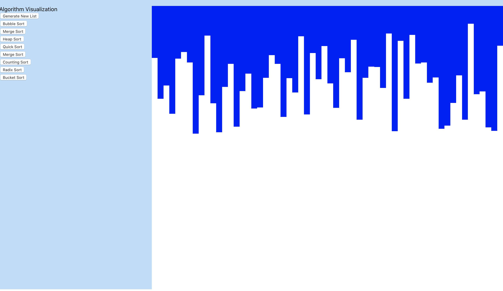

# AlgorithmVisualization

### This was being hosted on my home network with a Redis server also on my home network. Due to the security risk this poses I am currently moving this project to Azure Redis Cache and I will most likely host it on a box there.

## How to run
### Backend
`dart bin/dev.dart`

### Frontend
`npm install`

`npm start`

## To Do
- [ ] Write more algorithms
- [ ] Highlight current and when complete.
- [X] Clean up UI
- [ ] Host on Azure
